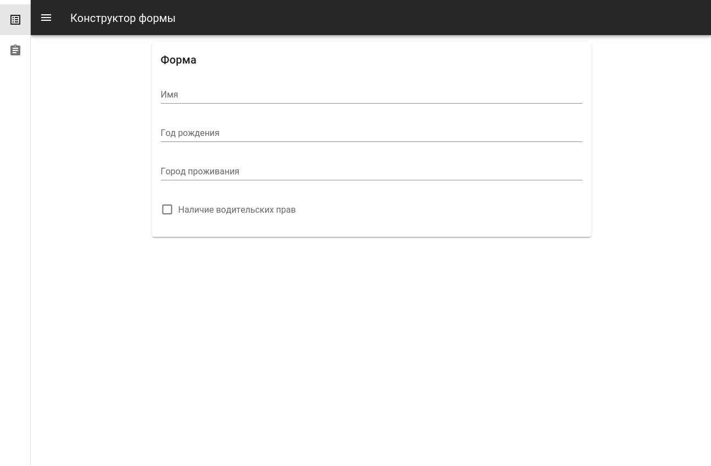

# Maxim




## <a href="http://maxim-homework.surge.sh" target="_blank">Демонстрационная страница</a>

## Первый запуск

### Установка зависимостей
```
yarn install
```

### Запуск приложения
```
yarn serve
```

## Как пользоваться

На главной странице располагается форма полями, собранные через конструктор

Для редактирования полей можно перейти в раздел "Редактировать структуру" через навигационное меню слева

## Структура приложения

```
├── src
│   ├── components
│   │   ├── VFilter - компонент конструктор для отображения полей
│   │   ├── VFormBuilder - компонент для редактирования/создания/удаления полей
│   │   ...
│   ├── store
│   │   ├── modules 
│   │   │   └── form.module.js - модуль для хранение конфигурации
│   │   ...
│   ├── views
│   │   ├── Edit
│   │   └── Form
```

## Что не было реализованно

* Загрузка собранного условия в конструктор
* Вывод результата в формате json
* Тесты
* Локализация

## Минусы приложения
* Создание уникальных ключей для полей на клиентской стороне
